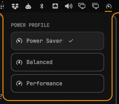

# Power Profile — Omarchy bar widget

A small [Omarchy](https://omarchy.org/) shell bar widget for switching power profiles (power-profiles-daemon).



- **Left-click** opens a dropdown with Power Saver / Balanced / Performance. The active profile is highlighted, and clicking another one switches to it.
- **Right-click** cycles to the next profile without opening the dropdown.
- **Scroll** cycles forward or back.
- **Keyboard** (dropdown open): arrow keys move, Enter selects, Esc closes.

Performance is only listed when your hardware supports it. The icon follows profile changes made elsewhere, such as `powerprofilesctl` or the battery service.

## Install

```bash
git clone https://github.com/NickPittas/omarchy-power-profile ~/.config/omarchy/plugins/npittas.power-profile
omarchy bar put npittas.power-profile --before omarchy.power
```

You can also toggle the dropdown from the command line: `omarchy-shell npittas.power-profile toggle`.

Requires `power-profiles-daemon`.
